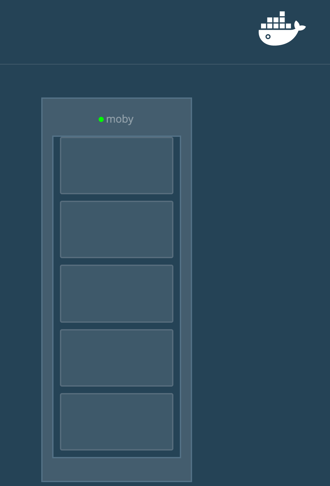

*** note ***

I did some improvements to the original https://github.com/ManoMarks/docker-swarm-visualizer

It adds node and container data to make this visualizer a better swarm monitoring tool.

Here is a sample image of nodes with data:


see installation instructions from https://github.com/ManoMarks/docker-swarm-visualizer below

(changed the dockerhub id from manomarks/visualizer to turaaa/swarmvisualizer:latest):

# Docker Swarm Visualizer

Demo container that displays Docker services on a Docker Swarm a diagram.

Each node in the swarm will show all tasks running on it. When a service goes down it'll be removed. When a node goes down it won't, instead the circle at the top will turn red to indicate it went down. Tasks will be removed.
Occasionally the Remote API will return incomplete data, for instance the node can be missing a name. The next time info for that node is pulled, the name will update.

To run: `docker run -it -d -p 8080:8080 -e HOST=[YOURHOST] -v /var/run/docker.sock:/var/run/docker.sock turaaa/swarmvisualizer:latest`

If port 8080 is already in use on your host, you can specify e.g. `-p [YOURPORT]:[YOURPORT] -e HOST=[YOURHOST] -e PORT=[YOURPORT]` instead.

Example: `docker run -it -d -p 5000:5000 -e HOST=localhost -e PORT=5000 -v /var/run/docker.sock:/var/run/docker.sock turaaa/swarmvisualizer:latest`

In some cases, you need to run the docker with your master node hostname instead the IP

Example: `docker run -it -d -p 5000:5000 -e HOST=node-master -e PORT=5000 -v /var/run/docker.sock:/var/run/docker.sock turaaa/swarmvisualizer:latest`

## Running on ARM

[@alexellisuk](https://twitter.com/alexellisuk) has pushed an image to the Docker Hub as `alexellis2/visualizer-arm:latest` it will run the code on an ARMv6 or ARMv7 device such as the Raspberry Pi. 

If you would like to build the image from source run the following command:

```
$ docker build -f Dockerfile.arm -t visualizer-arm:latest .
```

## Sample

Here's a sample with one node:



TODO:
* Take out or fix how dist works
* Comment much more extensively
* Create tests and make them work better
* Make CSS more elastic. Currently optimized for 3 nodes on a big screen

