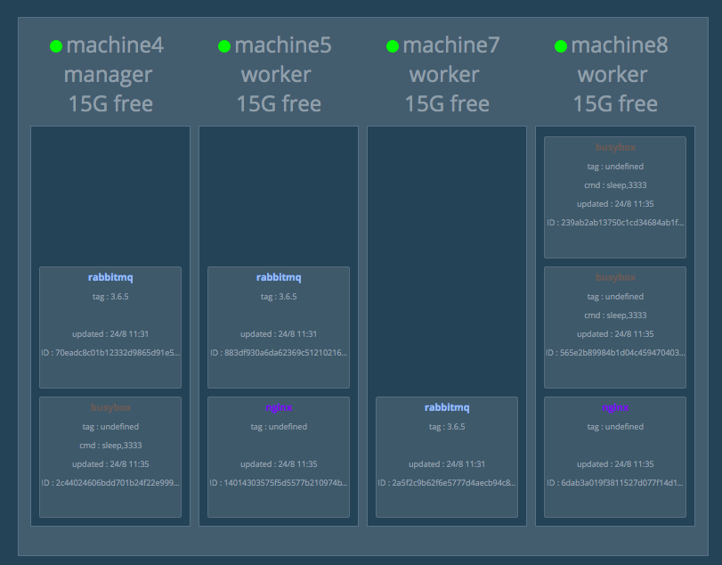

# Docker Swarm Visualizer
*** note ***
_This only works with Docker Swarm Mode in Docker Engine 1.12.0 and later. It does not work with the separate Docker Swarm project_
> Also this is a sample app meant for learning Docker. Running this app in production is insecure and should be avoided. If you want to run it in production you must take all security precautions, and in particular [Protect the Docker daemon socket](https://docs.docker.com/engine/security/https/) with SSL.

This project was originally created by [Francisco Miranda](https://github.com/maroshii) for the 2015 DockerCon EU keynote. It was adapted to be used for the 2016 DockerCon US keynote showcasing [Docker swarm mode](https://docs.docker.com/engine/swarm/). Since then the community has generously contributed many updates. Thanks to all the contributors, and a special thanks to [@DovAmir](https://github.com/DovAmir) and [@alexellis](https://github.com/alexellis) for their big contributions.

Demo container that displays Docker services running on a Docker Swarm in a diagram.

This works only with [Docker swarm mode](https://docs.docker.com/engine/swarm/) which was introduced in Docker 1.12. These instructions presume you are running on the master node and you already have a Swarm running.

Each node in the swarm will show all tasks running on it. When a service goes down it'll be removed. When a node goes down it won't, instead the circle at the top will turn red to indicate it went down. Tasks will be removed.
Occasionally the Remote API will return incomplete data, for instance the node can be missing a name. The next time info for that node is pulled, the name will update.

To run:

```
$ docker run -it -d -p 8080:8080 -v /var/run/docker.sock:/var/run/docker.sock dockersamples/visualizer
```

If port 8080 is already in use on your host, you can specify e.g. `-p [YOURPORT]:8080` instead. Example:

```
$ docker run -it -d -p 5000:8080 -v /var/run/docker.sock:/var/run/docker.sock dockersamples/visualizer
```

To run with a different context root (useful when running behind an external load balancer):

```bash
$ docker run -it -d -e CTX_ROOT=/visualizer -v /var/run/docker.sock:/var/run/docker.sock dockersamples/visualizer
```

To run in a docker swarm:

```
$ docker service create \
  --name=viz \
  --publish=8080:8080/tcp \
  --constraint=node.role==manager \
  --mount=type=bind,src=/var/run/docker.sock,dst=/var/run/docker.sock \
  dockersamples/visualizer
```

## Supported architectures

The main `dockersamples/visualizer` image supports **linux/amd64**.

**For armhf**, there is a pre-built image available. See [Running on ARM](#running-on-arm).

**For Windows**, there is a separate `Dockerfile.windows` and image. See [Running on Windows](#running-on-windows).

**Missing your architecture?** See [Building a custom image](#building-a-custom-image).

## Running on ARM

[@alexellisuk](https://twitter.com/alexellisuk) has pushed an image to the Docker Hub as `alexellis2/visualizer-arm:latest` it will run the code on an ARMv6 or ARMv7 device such as the Raspberry Pi.

```
$ docker service create \
  --name=viz \
  --publish=8080:8080/tcp \
  --constraint=node.role==manager \
  --mount=type=bind,src=/var/run/docker.sock,dst=/var/run/docker.sock \
  alexellis2/visualizer-arm:latest
```

* Update/rebuild the image:

If you would like to build the image from source run the following command:

```
$ docker build -t visualizer-arm:latest .
```

> Make sure you do this on a Raspberry Pi directly.

[View on Docker Hub](https://hub.docker.com/r/alexellis2/visualizer-arm/tags/)

## Running on Windows

[@StefanScherer](https://github.com/StefanScherer) has pushed an image to the
Docker Hub as `stefanscherer/visualizer-windows:latest` it will run the code
in a Windows nanoserver container.

If you would like to build the image from source run the following command:

```
$ docker build -f Dockerfile.windows -t visualizer-windows:latest .
```

On Windows you cannot use `-v` to bind mount the named pipe into the container.
Your Docker engine has to listen to a TCP port, eg. 2375 and you have to
set the `DOCKER_HOST` environment variable running the container.

```
$ip=(Get-NetIPAddress -AddressFamily IPv4 `
   | Where-Object -FilterScript { $_.InterfaceAlias -Eq "vEthernet (HNS Internal NIC)" } `
   ).IPAddress

docker run -d -p 8080:8080 -e DOCKER_HOST=${ip}:2375 --name=visualizer stefanscherer/visualizer-windows
```

### Connect to a TLS secured Docker engine

To work with a TLS secured Docker engine on Windows, set the environment variable `DOCKER_TLS_VERIFY` and
bind mount the TLS certificates into the container.
 
```
$ip=(Get-NetIPAddress -AddressFamily IPv4 `
   | Where-Object -FilterScript { $_.InterfaceAlias -Eq "vEthernet (HNS Internal NIC)" } `
   ).IPAddress

docker run -d -p 8080:8080 -e DOCKER_HOST=${ip}:2376 -e DOCKER_TLS_VERIFY=1 -v "$env:USERPROFILE\.docker:C:\Users\ContainerAdministrator\.docker" --name=visualizer stefanscherer/visualizer-windows
```

## Building a custom image
*When building for Windows, see [Running on Windows](#running-on-windows)*.

To build an up-to-date image for any architecture supported by [node:8-alpine](https://hub.docker.com/_/node/) (currently `amd64`, `arm32v6`, `arm32v7`, `arm64v8`, `i386`, `ppc64le` and `s390x`), execute the following command on a device of your target architecture:
```
$ docker build -t visualizer-custom:latest .
```

Afterwards you can start visualizer by using any of the commands stated [above](#docker-swarm-visualizer). Just replace `dockersamples/visualizer` with `visualizer-custom`. For example:
```
$ docker run -it -d -p 8080:8080 -v /var/run/docker.sock:/var/run/docker.sock visualizer-custom
```


## TODO:
* Take out or fix how dist works
* Comment much more extensively
* Create tests and make them work better
* Make CSS more elastic. Currently optimized for 3 nodes on a big screen
